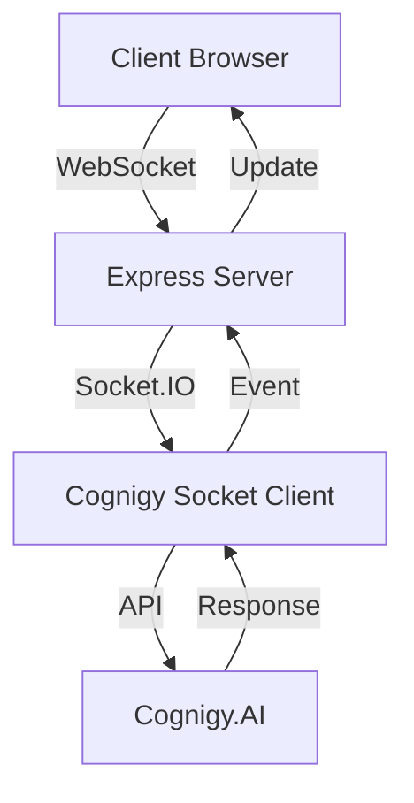

# Cognigy WebSocket Chat Application

A modern, real-time chat application built with Cognigy Socket Client, featuring a beautiful blue-themed UI and support for Adaptive Cards.


## 🌟 Features

### Real-time Communication
- Instant messaging with Cognigy AI
- Real-time connection status indicators
- Animated radar for connection feedback
- Message delivery confirmation

### Rich Message Support
- Text messages with markdown support
- Adaptive Cards with dynamic content
- Interactive buttons and quick replies
- Image and media attachments
- Form inputs with validation

### Modern UI/UX
- Beautiful blue-themed design
- Responsive layout for all devices
- Smooth animations and transitions
- Custom scrollbars and hover effects
- Split view with message flow tracking

### Technical Features
- WebSocket-based communication
- Real-time message flow monitoring
- Error handling and recovery
- Session management
- Message history

## 🚀 Getting Started

### Prerequisites
- Node.js (v14 or higher)
- npm (v6 or higher)
- A Cognigy.AI account with API access

### Installation

1. Clone the repository:
```bash
git clone https://github.com/yourusername/cogwebchatsocket.git
cd cogwebchatsocket
```

2. Install dependencies:
```bash
npm install
```

3. Configure your Cognigy credentials:
Create a `.env` file in the root directory:
```env
COGNIGY_ENDPOINT_URL=your_endpoint_url
COGNIGY_TOKEN=your_token
```

4. Start the application:
```bash
npm start
```

The application will be available at `http://localhost:3000`

## 💻 Usage Guide

### Connecting to Cognigy

1. The application automatically connects to Cognigy when loaded
2. Watch the connection indicator in the header:
   - 🟢 Green: Connected
   - 🔴 Red: Disconnected
   - 🔄 Animated radar shows active connection

### Sending Messages

1. Type your message in the input field
2. Click the send button or press Enter
3. Watch the message flow panel for technical details

### Using Interactive Elements

#### Buttons
- Click once to activate
- Buttons become disabled after selection
- Support for multiple choice options

#### Quick Replies
- Appear as chip-style buttons
- Disappear after selection
- Can include images and icons

#### Adaptive Cards
1. Fill in required fields
2. Submit using the form button
3. Watch for validation messages

## 🔧 Technical Architecture

### Component Flow Diagram


### Code Structure

```plaintext
cogwebchatsocket/
├── public/
│   ├── index.html      # Main HTML
│   ├── styles.css      # Styling
│   ├── app.js          # Client logic
│   └── bundle.js       # Socket client bundle
├── index.js            # Server
├── package.json        # Dependencies
└── README.md          # Documentation
```

### Key Components

#### Frontend
- HTML5 for structure
- CSS3 with custom properties
- JavaScript ES6+
- Cognigy Socket Client

#### Backend
- Node.js
- Express.js
- Socket.IO
- Cognigy SDK

## 🎨 UI Components

### Header Section
```html
<div class="chat-header">
    <div class="header-content">
        <div class="bot-avatar">
            <i class="fas fa-robot"></i>
            <div class="bot-status"></div>
        </div>
        <h1>AI Assistant</h1>
    </div>
    <div class="connection-status">
        <div class="radar-container">
            <div class="radar-ring"></div>
            <div class="radar-dot"></div>
        </div>
        <div class="status-info">
            <i class="fas fa-plug"></i>
            <span class="status-text">Connected</span>
        </div>
    </div>
</div>
```

### Message Types

#### Text Message
```html
<div class="message bot-message">
    <div class="message-text">Hello! How can I help you today?</div>
</div>
```

#### Quick Reply
```html
<div class="quick-replies-container">
    <button class="quick-reply">
        
        <span>Option 1</span>
    </button>
</div>
```

## 🔄 Message Flow

1. User Input → Client
2. Client → WebSocket
3. WebSocket → Cognigy
4. Cognigy → Process
5. Response → Client
6. Client → Display

## 🎯 Style Guide

### Colors
- Primary Blue: `#2196F3`
- Secondary Blue: `#1A237E`
- Accent Blue: `#42A5F5`
- Background: `#0D1117`
- Text Light: `#E3F2FD`
- Text Dark: `#000000`

### Typography
- Headers: Orbitron
- Body: Poppins
- Monospace: Monaco/Consolas

### Spacing
- Base unit: 4px
- Padding: 16px/20px
- Margins: 8px/16px

## 🛠 Development

### Building
```bash
npm run build
```

### Testing
```bash
npm test
```

### Deployment
```bash
npm run deploy
```

## 📱 Responsive Design

### Breakpoints
- Desktop: > 1200px
- Tablet: 768px - 1200px
- Mobile: < 768px
- Small Mobile: < 480px

### Layout Changes
- Desktop: Side-by-side view
- Tablet: Adjusted ratios
- Mobile: Stacked view
- Small: Optimized spacing

## 🤝 Contributing

1. Fork the repository
2. Create a feature branch
3. Commit your changes
4. Push to the branch
5. Open a Pull Request

## 📄 License

This project is licensed under the MIT License - see the [LICENSE](LICENSE) file for details.

## 🙏 Acknowledgments

- Cognigy.AI for the powerful conversational AI platform
- Font Awesome for the beautiful icons
- The open-source community for inspiration

## 📞 Support

For support, please:
1. Check the documentation
2. Search existing issues
3. Open a new issue if needed

---

Built with ❤️ using Cognigy.AI
